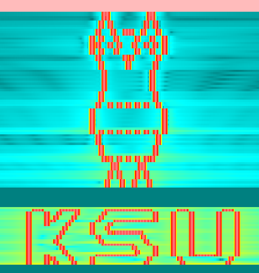

# ASCII to Spectrum Project  
This project converts an ascii string into an output over the spectrum.  
# Characters that are able to be used  
The following characters are readable by the program:  
| Character |   
| ---- | 
| " - " |   
| " | " |   
| " \\ " |   
| " / " |   
| " . "  |  
| " _ " |  
| " \' " |  
| " < " |  
| " > " |  
| " * " |  
| " ^ " |  
| " ( " |  
| " ) " |  

If you enter a charater that is not represented above, the program will still continue and it will simply have a blank where you might expect that character. The only character that is **reserved** is the character `n`. Use this letter to signify the end of a line(see example for usage).
# Example 
Starting Ascii Conecpt
```
         /\ _ /\
        |(*) (*)|
         \  ^  /
         /.....\
         .......
         \...../
          /\ /\
  _  __   _____   _    _ 
 | |/ /  / ____| | |  | |
 | ' /  | (___   | |  | |
 |  <    \___ \  | |  | |
 | . \   ____) | | |__| |
 |_|\_\ |_____/   \____/  
```  
Convert the string into one line that is able to be read by python. Make sure to do the following:  
1.) Convert any '\' to '\\'  
2.) Convert any "'" to "\'"  
3.) put an n at the end of each line, this is so the algorithm can change lanes when executing  
After doing these steps, you will get this good looking string. Put it into the "string" variable for the block, be sure to include the leading quotations below
```
'         /\\ _ /\ n        |(*) (*)| n         \\  ^  / n         /.....\\  n        |.......| n         \\...../ n          /\\ /\\ n  _  __   _____   _    _ n | |/ /  / ____| | |  | | n | \' /  | (___   | |  | | n |  <    \___ \  | |  | | n | . \\   ____) | | |__| | n |_|\_\\ |_____/   \\____/  n'
```  
Use these parameters:  
| Variable | Value | 
| ------- | -----| 
| Base Frequency | 1000 |   
| Sample Rate | 20e6 | 
| T | 1 | 

And your output will look like this:  

